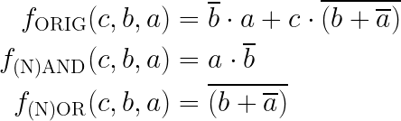

# Lab 1: JAKUB LEPIK

### De Morgan's laws

1. Equations of all three versions of logic function f(c,b,a):

	

2. Listing of VHDL architecture from design file (`design.vhd`) for all three functions. Always use syntax highlighting, meaningful comments, and follow VHDL guidelines:

```vhdl
architecture dataflow of gates is
begin
    f_orig_o <= (not(b_i) and a_i) or
                (c_i and not(b_i or not(a_i)));
    f_nand_o <= not(b_i) and a_i;
    f_nor_o <= (not(a_i) nor (b_i));
end architecture dataflow;
```

3. Complete table with logic functions' values:

   | **c** | **b** |**a** | **f_ORIG** | **f_(N)AND** | **f_(N)OR** |
   | :-: | :-: | :-: | :-: | :-: | :-: |
   | 0 | 0 | 0 | 0 | 0 | 0 |
   | 0 | 0 | 1 | 1 | 1 | 1 |
   | 0 | 1 | 0 | 0 | 0 | 0 |
   | 0 | 1 | 1 | 0 | 0 | 0 |
   | 1 | 0 | 0 | 0 | 0 | 0 |
   | 1 | 0 | 1 | 1 | 1 | 1 |
   | 1 | 1 | 0 | 0 | 0 | 0 |
   | 1 | 1 | 1 | 0 | 0 | 0 |

### Distributive laws

1. Screenshot with simulated time waveforms. Always display all inputs and outputs (display the inputs at the top of the image, the outputs below them) at the appropriate time scale!

   

3. Link to your public EDA Playground example:

   [https://www.edaplayground.com/x/Ley9](https://www.edaplayground.com/x/Ley9)
   
### Experiments on your own

1. In EDA Playground, verify at least one of the Distributive laws:

Listing of VHDL architecture from design file (`design.vhd`) for both sides of ***First Distributive law*** equation:

```vhdl
architecture dataflow of gates is
begin
    f_fdl_left_o <= (a_i and b_i) or (a_i and c_i);
    f_fdl_right_o <= (a_i and (b_i or c_i));
end architecture dataflow;
```

Screenshot with simulated time waveforms for both sides of ***First Distributive law*** equation:
	
	