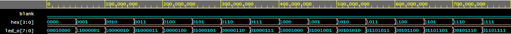

# Lab 4: JAKUB LEPÍK

### LED(7:4) indicators

1. Complete the truth table for LEDs(7:4) according to comments in source code.

   | **Hex** | **Inputs** | **LED4** | **LED5** | **LED6** | **LED7** |
   | :-: | :-: | :-: | :-: | :-: | :-: |
   | 0 | 0000 | 1 | 0 | 0 | 0 |
   | 1 | 0001 | 0 | 0 | 1 | 1 |
   | 2 | 0010 | 0 | 0 | 0 | 1 |
   | 3 | 0011 | 0 | 0 | 1 | 0 |
   | 4 | 0100 | 0 | 0 | 0 | 1 |
   | 5 | 0101 | 0 | 0 | 1 | 0 |
   | 6 | 0110 | 0 | 0 | 0 | 0 |
   | 7 | 0111 | 0 | 0 | 1 | 0 |
   | 8 | 1000 | 0 | 0 | 0 | 1 |
   | 9 | 1001 | 0 | 0 | 1 | 0 |
   | A | 1010 | 0 | 1 | 0 | 0 |
   | b | 1011 | 0 | 1 | 1 | 0 |
   | C | 1100 | 0 | 1 | 0 | 0 |
   | d | 1101 | 0 | 1 | 1 | 0 |
   | E | 1110 | 0 | 1 | 0 | 0 |
   | F | 1111 | 0 | 1 | 1 | 0 |

2. Listing of **LEDs(7:0)** of VHDL 'hex_led' entity architecture `led.vhd`.

>Decided to use a new entity 'hex_led' so I can just testbench it easily! 
>Otherwise I had no idea how to testbench the LED output we made in the lab.
>\n*Disclaimer: the entity actually works with all the LED indicators! i.e. LEDs(7:0)*
>
>Entire working VHDL code is available on my [EDA Playground](https://www.edaplayground.com/x/V4Ua).


  ```vhdl
  -- process driving all the LED indicators
  led_turn : process (hex) is
  begin
  
   -- first 4 LEDs are drived directly by the HEX bus
   led_o(3 downto 0) <= hex(3 downto 0);
   
   -- LED 4 turns on when input equals "0000"
   if (hex = "0000") then
        led_o(4) <= '1';
        else
        led_o(4) <= '0';
   end if;
   
   -- LED 5 turns on when input greater than "1001"
   if (hex > "1001") then
        led_o(5) <= '1';
        else
        led_o(5) <= '0';
   end if;
   
   -- LED 6 turns on when odd input
   led_o(6) <= hex(0);
   
   -- LED 7 turns on when input is a power of two
   case hex is
        when "0001" =>
           led_o(7) <= '1';
        when "0010" =>
           led_o(7) <= '1';
        when "0100" =>
           led_o(7) <= '1';
        when "1000" =>
           led_o(7) <= '1';
        when others =>
           led_o(7) <= '0';
   		end case;
        
  end process led_turn;
  ```
3. Screenshot with simulated time waveforms for LED(7:4). Always display all inputs and outputs (display the inputs at the top of the image, the outputs below them) at the appropriate time scale!

   


## Homework
Complete the decoder truth table for **common anode** 7-segment display.

   | **Symbol** | **Inputs** | **a** | **b** | **c** | **d** | **e** | **f** | **g** |
   | :-: | :-: | :-: | :-: | :-: | :-: | :-: | :-: | :-: |
   | 0 | 0000 | 0 | 0 | 0 | 0 | 0 | 0 | 1 |
   | 1 | 0001 | 1 | 0 | 0 | 1 | 1 | 1 | 1 |
   | 2 | 0010 | 0 | 0 | 1 | 0 | 0 | 1 | 0 |
   | 3 | 0011 | 0 | 0 | 0 | 0 | 1 | 1 | 0 |
   | 4 | 0100 | 1 | 0 | 0 | 1 | 1 | 0 | 0 |
   | 5 | 0101 | 0 | 1 | 0 | 0 | 1 | 0 | 0 |
   | 6 | 0110 | 0 | 1 | 0 | 0 | 0 | 0 | 0 |
   | 7 | 0111 | 0 | 0 | 0 | 1 | 1 | 1 | 1 |
   | 8 | 1000 | 0 | 0 | 0 | 0 | 0 | 0 | 0 |
   | 9 | 1001 | 0 | 0 | 0 | 0 | 1 | 0 | 0 |
   | A | 1010 | 0 | 0 | 0 | 1 | 0 | 0 | 0 |
   | b | 1011 | 1 | 1 | 0 | 0 | 0 | 0 | 0 |
   | C | 1100 | 0 | 1 | 1 | 0 | 0 | 0 | 1 |
   | d | 1101 | 1 | 0 | 0 | 0 | 0 | 1 | 0 |
   | E | 1110 | 0 | 1 | 1 | 0 | 0 | 0 | 0 |
   | F | 1111 | 0 | 1 | 1 | 1 | 0 | 0 | 0 |
