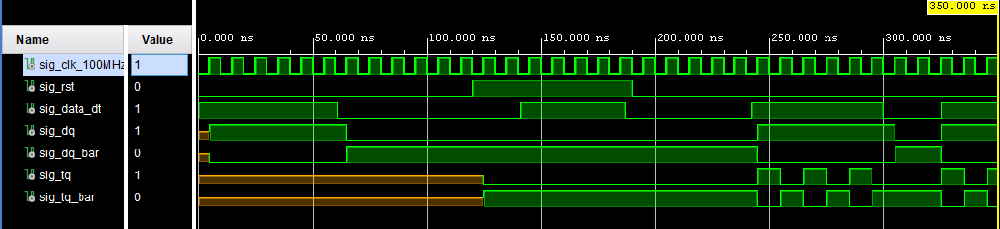
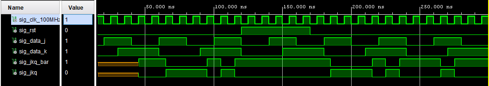
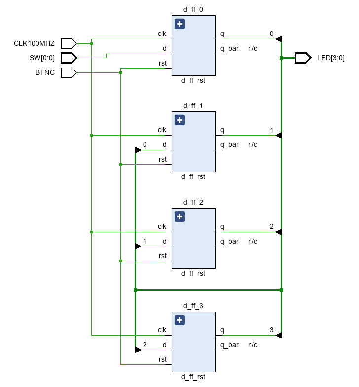
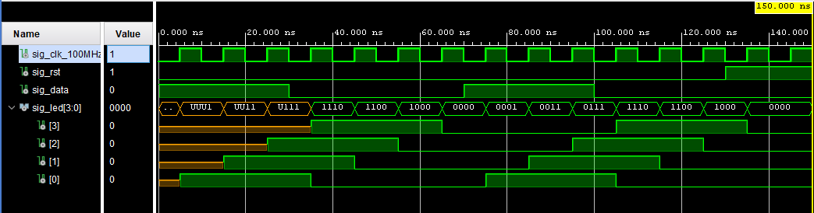

# Lab 5: JAKUB LEPÍK
>*The code is not available on my EDA Playground anymore as I decided to switch to Vivado instead. It has many advantages over EDA PG but sadly the visitor can not furthermore simulate my code without any external programs...*
>
>*The design files are located at [flip_flops/flip_flops.srcs/sources_1/new](flip_flops/flip_flops.srcs/sources_1/new).*               
>*The testbench files are located at [flip_flops/flip_flops.srcs/sim_1/new](flip_flops/flip_flops.srcs/sim_1/new).*                   
### D & T Flip-flops

1. Screenshot with simulated time waveforms. D and T type flip-flops in single testbench with a maximum duration of 350 ns, including reset. All inputs and outputs shown.

   

### JK Flip-flop

1. Listing of VHDL architecture for JK-type flip-flop.

```vhdl
architecture Behavioral of jk_ff_rst is
    -- it must use this local signal instead of output ports
    -- because "out" ports cannot be read within the architecture
    signal sig_q : std_logic;
begin
 p_jk_ff_rst : process (clk)
    begin
        if rising_edge(clk) then
            if (rst = '1') then 
                sig_q <= '0';
            else 
                -- characteristic bool logic function of JK-type flip flop
                sig_q <= (j and not sig_q) or (not k and sig_q);
            end if; 
        end if; 

    end process p_jk_ff_rst;
    -- output ports are permanently connected to local signal
    q     <= sig_q;
    q_bar <= not sig_q;
end architecture Behavioral;
```
2. Screenshot with simulated time waveforms of JK flip-flop.

   

### Shift register

1. Image of `top` level schematic of the 4-bit shift register. Four D-type flip-flops used. Schematic generated by Vivado.

   
   
2 Screenshot with simulated time waveforms of 4-bit shift register.

   
   
### Pre-Lab preparation
1.  Write characteristic equations and complete truth tables for D, JK, T flip-flops where q(n) represents main output value before the clock edge and q(n+1) represents output value after the clock edge.


   **D-type FF**
   | **clk** | **d** | **q(n)** | **q(n+1)** |
   | :-: | :-: | :-: | :-: | :-: |
   | ↑ | 0 | 0 | 0 |
   | ↑ | 0 | 1 | 0 |
   | ↑ | 1 | 0 | 1 |
   | ↑ | 1 | 1 | 1 |

   **JK-type FF**
   | **clk** | **j** | **k** | **q(n)** | **q(n+1)** |
   | :-: | :-: | :-: | :-: | :-: |
   | ↑ | 0 | 0 | 0 | 0 | 
   | ↑ | 0 | 0 | 1 | 1 |
   | ↑ | 0 | 1 | 0 | 0 |
   | ↑ | 0 | 1 | 1 | 0 |
   | ↑ | 1 | 0 | 0 | 1 |
   | ↑ | 1 | 0 | 1 | 0 |
   | ↑ | 1 | 1 | 0 | 1 |
   | ↑ | 1 | 1 | 1 | 0 |

   **T-type FF**
   | **clk** | **t** | **q(n)** | **q(n+1)** |
   | :-: | :-: | :-: | :-: |
   | ↑ | 0 | 0 | 0 |
   | ↑ | 0 | 1 | 1 |
   | ↑ | 1 | 0 | 1 |
   | ↑ | 1 | 1 | 0 |


