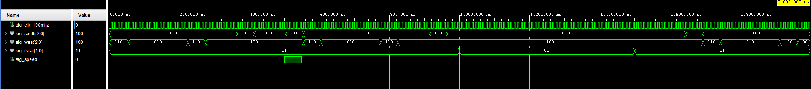
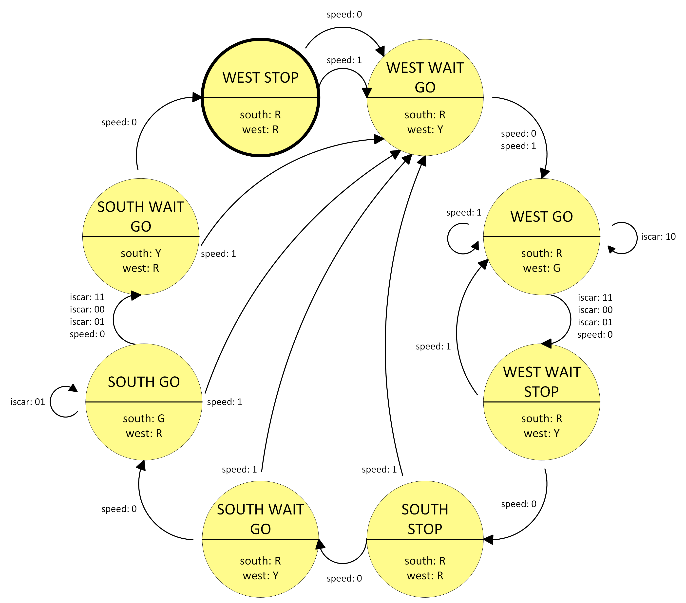

# Lab 8: JAKUB LEPIK

### Traffic light controller

1. Listing of VHDL code of the completed process `p_traffic_fsm`. Always use syntax highlighting, meaningful comments, and follow VHDL guidelines:

```vhdl
p_traffic_fsm : process (clk) is
  begin

    if (rising_edge(clk)) then
      if (rst = '1') then                    -- Synchronous reset
        sig_state <= WEST_STOP;              -- Init state
        sig_cnt   <= c_ZERO;                 -- Clear delay counter
      elsif (sig_en = '1') then
        -- Every 250 ms, CASE checks the value of sig_state
        -- local signal and changes to the next state 
        -- according to the delay value.
        case sig_state is

          when WEST_STOP =>
            -- Count to 4 secs
            if (sig_cnt < c_DELAY_2SEC) then
              sig_cnt <= sig_cnt + 1;
            else
              -- Move to the next state
              sig_state <= WEST_WAIT_GO;
              -- Reset local counter value
              sig_cnt <= c_ZERO;
            end if;
            
          when WEST_WAIT_GO =>
            -- Count to 1 secs
            if (sig_cnt < c_DELAY_1SEC) then
              sig_cnt <= sig_cnt + 1;
            else
              -- Move to the next state
              sig_state <= WEST_GO;
              -- Reset local counter value
              sig_cnt <= c_ZERO;
            end if;

          when WEST_GO =>
            -- Count to 4 secs
            if (sig_cnt < c_DELAY_4SEC) then
              sig_cnt <= sig_cnt + 1;
            else
              -- Move to the next state
              if (sig_iscar = "10") then
                sig_state <= WEST_GO;
              else
                sig_state <= WEST_WAIT_STOP;
              end if;
              -- Reset local counter value
              sig_cnt <= c_ZERO;
            end if;
          
          when WEST_WAIT_STOP =>
            -- Count to 1 secs
            if (sig_cnt < c_DELAY_1SEC) then
              sig_cnt <= sig_cnt + 1;
            else
              -- Move to the next state
              sig_state <= SOUTH_STOP;
              -- Reset local counter value
              sig_cnt <= c_ZERO;
            end if;
           
          when SOUTH_STOP =>
            -- Count to 4 secs
            if (sig_cnt < c_DELAY_2SEC) then
              sig_cnt <= sig_cnt + 1;
            else
              -- Move to the next state
              sig_state <= SOUTH_WAIT_GO;
              -- Reset local counter value
              sig_cnt <= c_ZERO;
            end if;
          
          when SOUTH_WAIT_GO =>
            -- Count to 1 secs
            if (sig_cnt < c_DELAY_1SEC) then
              sig_cnt <= sig_cnt + 1;
            else
              -- Move to the next state
              sig_state <= SOUTH_GO;
              -- Reset local counter value
              sig_cnt <= c_ZERO;
            end if;
          
          when SOUTH_GO =>
            -- Count to 4 secs
            if (sig_cnt < c_DELAY_4SEC) then
              sig_cnt <= sig_cnt + 1;
            else
              -- Move to the next state
              sig_state <= SOUTH_WAIT_GO;
              if (sig_iscar = "01") then
              sig_state <= SOUTH_GO;
              else
              sig_state <= SOUTH_WAIT_STOP;
              end if;
              -- Reset local counter value
              sig_cnt <= c_ZERO;
            end if;
            
          when SOUTH_WAIT_STOP =>
            -- Count to 1 secs
            if (sig_cnt < c_DELAY_1SEC) then
              sig_cnt <= sig_cnt + 1;
            else
              -- Move to the next state
              sig_state <= WEST_WAIT_GO;
              -- Reset local counter value
              sig_cnt <= c_ZERO;
            end if;


          when others =>
            -- It is a good programming practice to use the
            -- OTHERS clause, even if all CASE choices have
            -- been made.
            sig_state <= WEST_STOP;
            sig_cnt   <= c_ZERO;

        end case;

      end if; -- Synchronous reset
    end if; -- Rising edge
  end process p_traffic_fsm;
```
> *The process is a bit more advanced, there's the classic YELLOW translition in between of both STOP -> START and START -> STOP signals, there's also a sig_iscar signal which deals with the traffic when there are cars in one direction only (green stays on during that time). On the top of that there's sig_speed signal, which speeds up the process (safely) of turning the WEST direction traffic light to GREEN.*


2. Screenshot with simulated time waveforms. The full functionality of the entity must be verified. Always display all inputs and outputs (display the inputs at the top of the image, the outputs below them) at the appropriate time scale!

   
   
> *Including sig_iscar, sig_speed signals*


3. Figure of Moor-based state diagram of the traffic light controller with *speed button* to ensure a synchronous transition to the `WEST_GO` state. The image can be drawn on a computer or by hand. Always name all states, transitions, and input signals!

   

> *Including iscar, speed inputs*

  